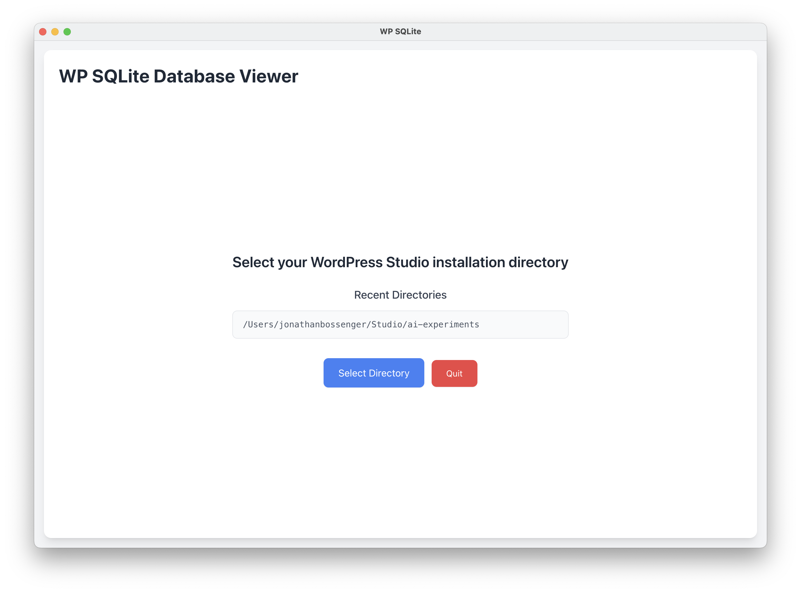

# WP SQLite


A desktop application for viewing and editing SQLite databases in [WordPress Studio](https://developer.wordpress.com/studio/) installations. Built with Electron and React.

## Table of Contents
- [Features](#features)
- [Screenshots](#screenshots)
- [Prerequisites](#prerequisites)
- [Development Setup](#development-setup)
- [Building Executables](#building-executables)
- [Creating Releases](#creating-releases)
- [Usage](#usage)
- [Technical Stack](#technical-stack)
- [License](#license)

## Features

- WordPress Studio Integration
  - Automatic detection of WordPress Studio installations
  - Finds SQLite database in wp-content/database/.ht.sqlite
  - Recent directories support for quick access
- Database Viewing
  - View all tables in the database
  - Browse table data with pagination (50 rows per page)
  - View table schema with primary key indicators
  - Search/filter within table data by specific columns or all columns
- Data Editing
  - Edit existing rows with modal editor
  - Delete rows (with confirmation)
  - Automatic data type detection
  - Primary key protection
- Clean, modern UI with real-time updates
- Cross-platform support (macOS, Windows, Linux)

## Screenshots

### Main Application Interface


### Additional Views
<p align="center">
  
  
  
</p>

## Prerequisites

- Node.js 18.x or higher
- npm 9.x or higher
- A [WordPress Studio](https://developer.wordpress.com/studio/) installation for testing ([GitHub](https://github.com/Automattic/studio/))

## Development Setup

1. Clone the repository:
```bash
git clone https://github.com/jonathanbossenger/wp-sqlite.git
cd wp-sqlite
```

2. Install dependencies:
```bash
npm install
```

3. Start the development server:
```bash
npm run dev
```

This will:
- Generate application icons
- Start webpack in watch mode for the renderer process
- Launch Electron in development mode
- Enable hot reloading for React components

## Building Executables

The project uses Electron Forge for building platform-specific executables.

### Build for all platforms:
```bash
npm run make
```

This will create executables in the `out/make` directory for:
- macOS (.dmg)
- Windows (.exe)
- Linux (.deb, .rpm)

### Platform-specific builds:

For macOS:
```bash
npm run make -- --platform=darwin
```

For Windows:
```bash
npm run make -- --platform=win32
```

For Linux:
```bash
npm run make -- --platform=linux
```

## Creating Releases

The repository includes a GitHub Actions workflow that automatically builds the application for all platforms when a new release is created.

### To create a new release:

1. Update the version in `package.json`
2. Commit the version change
3. Create and push a new git tag:
```bash
git tag v1.0.0
git push origin v1.0.0
```
4. Create a new release on GitHub:
   - Go to the repository's Releases page
   - Click "Draft a new release"
   - Select the tag you just created
   - Add release notes
   - Click "Publish release"

The GitHub Actions workflow will automatically:
- Build the application for Windows, macOS, and Linux
- Upload the following artifacts to the release:
  - **Windows**: `.exe` installer (Squirrel), `.msi` installer (WiX)
  - **macOS**: `.dmg` installer, `.zip` archive
  - **Linux**: `.deb` package, `.rpm` package, `.zip` archive

Users can then download and install the appropriate version for their operating system directly from the GitHub release page.

## Usage

1. Launch the application
2. Select your WordPress Studio installation directory
3. The app will automatically:
   - Detect the SQLite database at wp-content/database/.ht.sqlite
   - Load the list of tables
4. Select a table to view its data
5. Use pagination controls to navigate through rows
6. Edit or delete rows as needed
7. Use the column dropdown and search box to filter data by specific columns

### Editing Data

1. Click "Edit" on any row to open the edit modal
2. Modify the values (primary key fields are read-only)
3. Click "Save Changes" to update the row
4. Changes are immediately saved to the database

### Deleting Data

1. Click "Delete" on any row
2. Confirm the deletion
3. The row is permanently removed from the database

### Searching Data

1. Select a column from the dropdown menu (or "All Columns" to search across all fields)
2. Type your search query in the search box
3. The table will automatically filter to show only matching rows
4. The search is case-insensitive and matches partial text

## Technical Stack

- Electron - Desktop application framework
- React - UI framework
- Tailwind CSS - Styling and responsive design
- better-sqlite3 - SQLite database interface
- Sharp - Image processing for icons

## Development Scripts

- `npm run dev` - Start the application in development mode
- `npm run build` - Build the renderer process
- `npm run generate-icons` - Generate application icons
- `npm run generate-all` - Generate all icons
- `npm run package` - Package the application without creating installers
- `npm run make` - Create platform-specific distributables

## License

GPL-2.0-or-later
